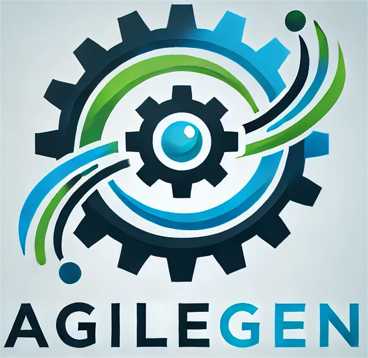

# AgileGen: Empowering Agile-Based Generative Software Development through Human-AI Teamwork

<p align="center">
  
</p>

- A generative software development agent for human-AI collaboration initiated from the perspective of end-users.
- Our preprint paper is avaliable at 📚: https://arxiv.org/abs/2407.15568
- Try the Huggingface Link 🤗: https://huggingface.co/spaces/HarrisClover/AgileGen
# Overview 📄


The interaction and collaboration design of AgileGen is divided into two parts.

(1) End-user Decision-Making is used to collaborate with end-users to collect and clarify end-user decisions.

(2) AgileGen Agent responds to user decisions by transforming and analyzing them, aiming to guide LLMs in generating software code consistent with user requirements. Scenarios Design and Rapid Prototype Design are two core components of the AgileGen.

- The Scenarios Design component is primarily used to design different scenarios represented in Gherkin language based on decision-making requirements, submit them to end-users for scenario decisions, and return the decided Gherkin scenarios.
- The Rapid Prototype Design component is responsible for generating software application code based on the decided Gherkin scenarios. It then presents the software application to users for acceptance, receives user feedback and suggestions, and makes necessary modifications to the code.

---

# ❓**What Can AgileGen (Sapper4SE) Do?**


https://github.com/HarrisClover/AgileGen/assets/33628813/8478c0d1-b511-4cae-8037-0c3f11f7074e

---
# 👨‍💻‍Human-AI collaboration process:

---
# ✈️Quick start

1. Configure your OpenAI key and VPN in utils/CodeGeneration.py
2. python ./main.py
3. Running on local URL:  http://127.0.0.1:0000 (your VPN)

**Example input:**
| Project Name                 | Description Features                                   |
| ------------------------------- | ----------------------------------------------------------------- |
| `NewsMeter`      | Evaluate the credibility of news articles by analyzing multiple factors and generating trustworthiness scores with explanations and evidence. |
| `VideoClipper`   | VideoClipper is a software application that allows users to easily clip and trim videos. It provides an intuitive interface to select specific sections of the video, and saves the trimmed video as a new file.|
| `SportArena`| Develop a user-friendly software application that allows users to create and customize virtual sports arenas.|
|`SoundBoard`| I'd like to have a website that displays cards with words on them and plays sounds when clicked.|
---


# 🔎Citation
```
@article{zhang2024empowering,
  title={Empowering Agile-Based Generative Software Development through Human-AI Teamwork},
  author={Zhang, Sai and Xing, Zhenchang and Guo, Ronghui and Xu, Fangzhou and Chen, Lei and Zhang, Zhaoyuan and Zhang, Xiaowang and Feng, Zhiyong and Zhuang, Zhiqiang},
  journal={arXiv preprint arXiv:2407.15568},
  year={2024}
}
```
